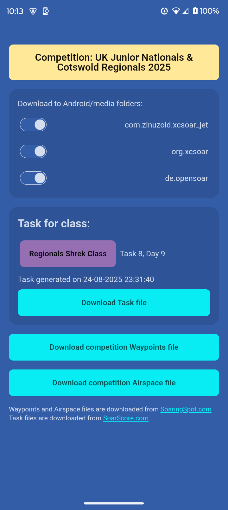
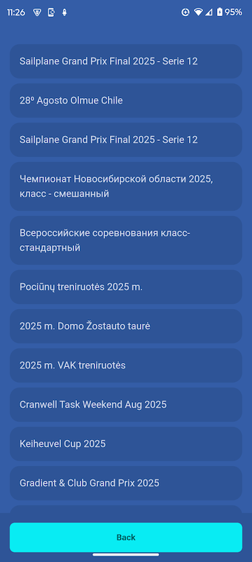

# XComps

XComps is a gliding competition manager for Android that can download **task**, **waypoint** and **airspace** files from ongoing competitions into **XCSoar** and its related forks.
It was inspired by Kedder's [**Compman**](https://github.com/kedder/openvario-compman) for the OpenVario.

It searches the `Android/media` folder for sub-folders containing "soar" in their name and lets you choose which ones to download to.
Then it places the downloaded files into the folders you selected.

The files for tasks, waypoints and airspaces are named `xcomps_task.tsk`, `xcomps_waypoints.cup` and `xcomps_airspace.txt`, respectively. 
The files are overwritten each time you download a new one.

You can download the `.apk` file from the [**Releases**](https://github.com/DanielDe8/xcomps/releases) tab.

**Warning**: this app may not work with older versions of XCSoar, because they don't store their data in the `Android/media` folder. 
It is recommended to use the latest version of XCSoar, available at [https://xcsoar.org/download](https://xcsoar.org/download)

Tasks are downloaded from [SoarScore.com](https://soarscore.com). 
Waypoint and airspace files are downloaded from [SoaringSpot.com](https://soaringspot.com).

## Screenshots

